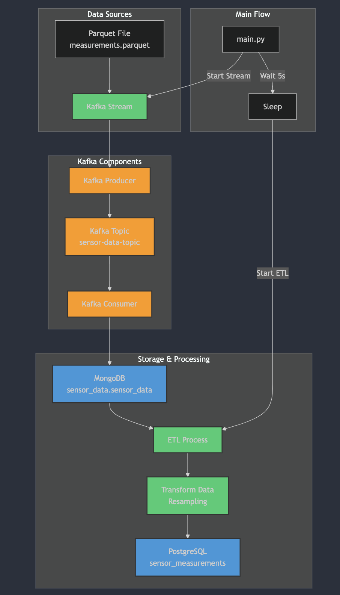

# About Project

This is a simple project that demonstrates streaming and batch processing using Apache Kafka, MongoDB, Pandas and PostgreSQL, containerized with Docker. As shown in the project structure below, first, a parquet file is streamed with Kafka and written to the MongoDB database. From there, the data is processed with Pandas and written into a PostgreSQL database.

# Project Structure



# How to run

Run docker compose up within project directory.

```docker
docker compose up -d
```

After all system checked up and running, you can check the logs by

```docker
docker logs -f $(docker compose ps -q python-app)
```

```bash
"Data successfully written to PostgreSQL"
```

Above message indicates the project successfully finished. You can check postgres database using

```bash
bash  query_postgres.sh
```

---

## Unit testing

To run Unit test, use below command

```bash
python -m pytest test_all.py -v
```
